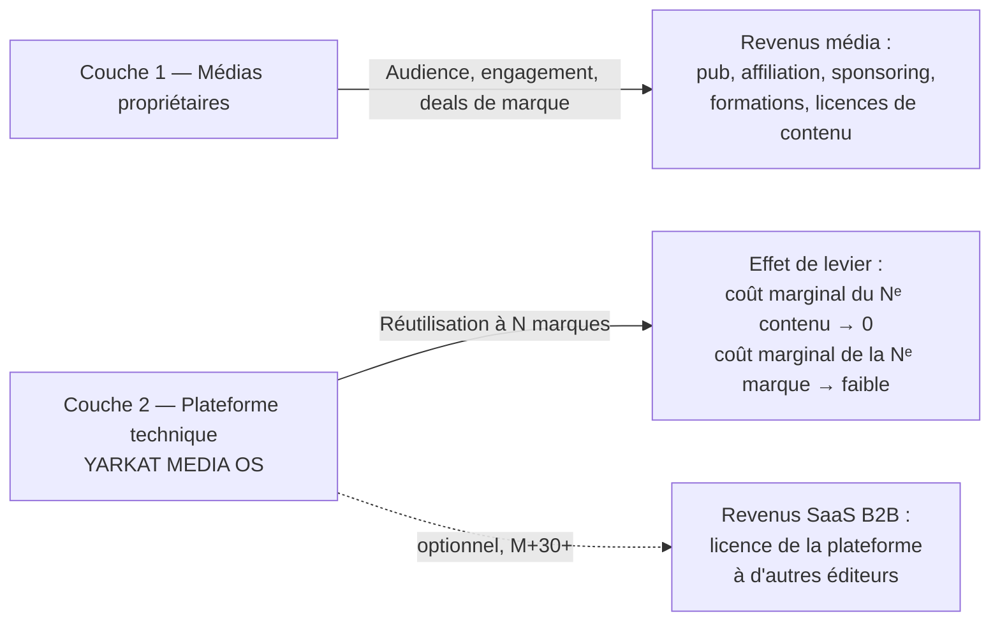
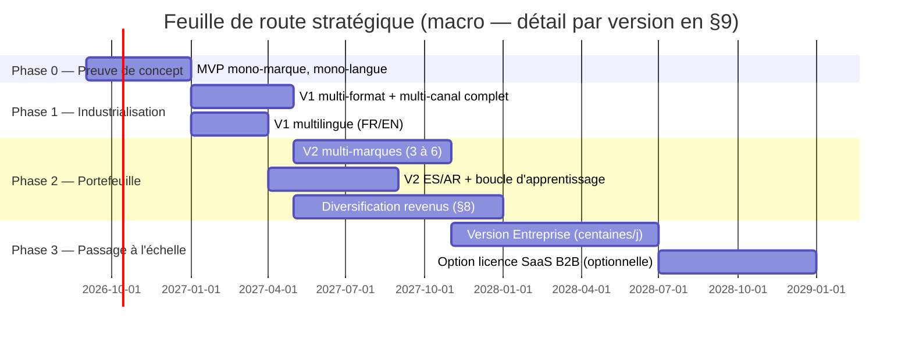

# 1. Vision stratégique
*Rôle simulé : entrepreneur / CEO de la filiale, pour le comité d'investissement de la holding.*

← [Sommaire](README.md) · Suivant → [Architecture système](02-architecture-systeme.md)

---

## 1.1 Mission

> Produire et distribuer, à l'échelle industrielle et à coût marginal décroissant, des contenus multi-formats et multilingues de qualité éditoriale professionnelle, en combinant supervision humaine légère et automatisation IA de bout en bout — pour bâtir un portefeuille de marques média détenues en propre par la holding, plutôt que de dépendre de la distribution d'un tiers.

Trois idées structurent tout le reste du dossier :

1. **La marque appartient à la holding, la plateforme est l'actif industriel.** Le studio n'est pas un projet de contenu isolé : c'est une usine à marques (`multi-tenant`), chaque marque étant une ligne de production indépendante sur un socle technique unique.
2. **L'humain se déplace vers la supervision, pas vers l'exécution.** Les agents IA exécutent ; les humains valident les points à risque (fact-checking sensible, image de marque, conformité) et pilotent la stratégie éditoriale.
3. **La donnée de performance reboucle sur la production.** Chaque contenu publié nourrit un modèle d'apprentissage qui ajuste les sujets, formats et hooks des contenus suivants — la boucle fermée est l'avantage compétitif durable, pas la génération elle-même (qui se banalise).

## 1.2 Objectifs (12–36 mois)

| Horizon | Objectif business | Indicateur cible | 🟡/🔴 |
|---|---|---|---|
| M+6 | Prouver le pipeline bout-en-bout sur **1 marque pilote**, 1 langue | 30 contenus longs + 90 déclinaisons courtes publiés, coût/contenu mesuré | 🟡 |
| M+12 | Industrialiser sur **3 marques**, 2 langues (FR/EN) | 500 publications/mois, taux d'intervention humaine < 20 % du temps agent | 🟡 |
| M+18 | Monétisation multi-source active | ≥ 3 leviers de revenus simultanés (cf. §8) générant un ARR positif | 🔴 |
| M+24 | 4 langues (FR/EN/ES/AR), 6+ marques | Quelques centaines de contenus/jour à l'échelle du portefeuille | 🔴 |
| M+36 | Plateforme cédable/licensable | Le socle technique peut être vendu en marque blanche (SaaS B2B) à d'autres éditeurs | 🔴 |

🔴 Les volumes M+18 à M+36 sont des cibles d'ambition, pas des prévisions engageantes : ils dépendent de la vitesse d'apprentissage des 6 premiers mois. Le plan de développement (§9) définit des jalons de décision go/no-go plutôt qu'un calendrier figé.

## 1.3 Modèle économique — vue d'ensemble

La filiale opère sur **deux couches économiques distinctes**, qu'il faut piloter séparément :

- **Couche 1 (le contenu)** se valorise comme n'importe quel média : audience → attention → monétisation. Détail des 10 leviers en `08-modele-economique.md`.
- **Couche 2 (la plateforme)** est l'actif défendable : chaque marque supplémentaire coûte marginalement moins cher à opérer que la précédente, car les agents, prompts, pipelines et infrastructures sont mutualisés. C'est elle qui justifie le statut de « filiale patrimoniale » plutôt que « projet de contenu » : sa valeur d'entreprise ne dépend pas d'une seule marque qui pourrait perdre en popularité.

🟡 Recommandation : **ne pas ouvrir la Couche 2 (licence SaaS à des tiers) avant M+24**. Vendre l'outil trop tôt disperse l'effort et crée un concurrent potentiel sur la Couche 1. Le SaaS B2B est une option de sortie/diversification, pas un objectif de l'an 1.

## 1.4 Avantages concurrentiels visés

| Avantage | Nature | Comment il se construit |
|---|---|---|
| **Coût marginal de production quasi nul** | Structurel | Automatisation bout-en-bout (§4) ; un créateur humain classique ne peut pas produire à ce volume/coût |
| **Vitesse de réaction aux tendances** | Structurel | Agent de détection de tendances + pipeline < 24h entre détection et publication (cible M+12) |
| **Portefeuille multi-marques mutualisé** | Structurel | Une seule infrastructure amortie sur N marques ; le risque n'est pas concentré sur une seule audience |
| **Boucle d'apprentissage propriétaire** | Cumulatif, difficile à copier | Historique de performance par format/sujet/langue = donnée propriétaire qui s'améliore avec le temps |
| **Qualité éditoriale supervisée** | Différenciateur vs. contenu IA générique | Agents Fact-checker + Responsable qualité en garde-fou (§3) — vs. concurrents 100 % automatisés sans contrôle |
| **Multilingue natif dès la conception** | Élargit le marché adressable ×4 dès le départ | FR/EN/ES/AR couvrent une part significative de la population mondiale connectée |

🔴 Aucun de ces avantages n'est acquis : ce sont des choix de conception qui *peuvent* produire un avantage s'ils sont exécutés avec discipline (notamment la boucle qualité, souvent sacrifiée en premier sous pression de volume).

## 1.5 Risques

| Risque | Impact | Probabilité | Mitigation |
|---|---|---|---|
| **Dépendance aux plateformes tierces** (changement d'algorithme, suspension de compte, changement de CGU sur l'usage de l'IA) | Élevé | Élevée | Diversifier sur 10 canaux dès le départ ; ne jamais dépendre de plateformes qui pourraient couper l'accès du jour au lendemain (posséder blog + newsletter en propre = actifs non désintermédiables) |
| **Détection de contenu IA / pénalité algorithmique** (YouTube, Meta, TikTok ajustent leurs politiques sur le contenu synthétique) | Élevé | Moyenne à élevée | Supervision humaine sur le montage final ; divulgation conforme aux règles de chaque plateforme (label « contenu IA » quand requis) ; garder un niveau de personnalisation/valeur ajoutée humaine (voix de marque, angle éditorial) |
| **Risque réputationnel** (erreur factuelle publiée à grande échelle, image générée problématique, biais) | Élevé | Moyenne | Agent Fact-checker obligatoire avant publication ; check-list qualité humaine sur tout contenu sensible (santé, finance, politique, mineurs) ; pas de publication 100 % automatique sur ces catégories (cf. `06-automatisation.md` §validations) |
| **Droits d'auteur / droit à l'image des contenus générés** | Moyen à élevé | Moyenne | 🔴 Statut juridique de l'IA générative encore mouvant selon juridictions — nécessite un avis juridique dédié avant commercialisation à grande échelle ; privilégier des outils dont les CGU couvrent l'usage commercial (cf. `05-comparatif-outils.md`) |
| **Coût API incontrôlé si le volume explose sans garde-fou** | Moyen | Moyenne | Budgets par agent/marque avec plafonds automatiques (cf. `06-automatisation.md`) ; FinOps intégré au dashboard (§7) |
| **Qualité perçue « contenu IA générique »** entraînant un désengagement d'audience | Élevé | Moyenne à élevée | Différenciation éditoriale forte par marque (angle, personnage récurrent, univers visuel cohérent) plutôt que contenu générique interchangeable |
| **Concentration des compétences chez un petit nombre de personnes clés** (prompt engineering, orchestration) | Moyen | Moyenne | Documentation systématique (`10-documentation-technique.md`), templates de prompts versionnés en base de code, pas de « savoir tacite » |
| **Évolution réglementaire (AI Act UE, obligations de transparence)** | Moyen | Élevée à moyen terme | Concevoir la traçabilité (quel agent/modèle a produit quoi) dès le socle technique, pas en rattrapage |

## 1.6 Barrières à l'entrée (pour la filiale elle-même, et contre des imitateurs)

**Ce qui protège l'entreprise une fois construite :**
- Bibliothèque de prompts et de workflows affinés par l'usage réel (des milliers d'itérations A/B non reproductibles instantanément par un concurrent).
- Historique de performance par audience/format = signal d'apprentissage propriétaire.
- Portefeuille de marques avec audiences déjà constituées (coût d'acquisition déjà payé).
- Infrastructure amortie : un nouvel entrant doit payer le même coût fixe d'architecture pour un volume initial bien plus faible.

**Ce qui NE protège PAS (à ne pas surestimer) :**
- Les outils IA sous-jacents (LLM, génération image/vidéo) sont accessibles à tous — **l'avantage n'est jamais dans l'outil, toujours dans l'exécution et la donnée accumulée**.
- Le simple fait d'automatiser n'est plus différenciant en 2026 : de nombreux acteurs le font déjà. La différenciation vient de la qualité éditoriale + vitesse + discipline de mesure.

## 1.7 Feuille de route à 3 ans (vue macro)

| Année | Jalon principal | Décision go/no-go |
|---|---|---|
| **Année 1** | MVP + V1 validés sur 1 marque pilote | Le coût par contenu baisse-t-il avec le volume ? Le taux de correction humaine baisse-t-il avec l'apprentissage ? Si non → revoir l'architecture agents avant de dupliquer sur d'autres marques. |
| **Année 2** | Portefeuille de 3 à 6 marques, 4 langues, monétisation multi-source | Au moins 1 marque atteint un seuil de rentabilité unitaire (revenus > coûts d'infra + API alloués) ? Sinon → concentrer les ressources sur la/les marques qui fonctionnent plutôt que diluer sur toutes. |
| **Année 3** | Passage à l'échelle industrielle, option de valorisation de la plateforme (licence ou cession partielle) | La plateforme tourne-t-elle avec une équipe stable sans dépendance à 1-2 personnes clés ? Condition nécessaire avant toute discussion de cession/licence. |

🟡 Recommandation forte : traiter chaque « année » comme une porte de décision et non un engagement calendaire irréversible. La nature du produit (contenu + IA générative) évolue vite ; le plan doit rester révisable trimestriellement (cf. rituel de pilotage en `09-plan-developpement.md`).

---
← [Sommaire](README.md) · Suivant → [Architecture système](02-architecture-systeme.md)
