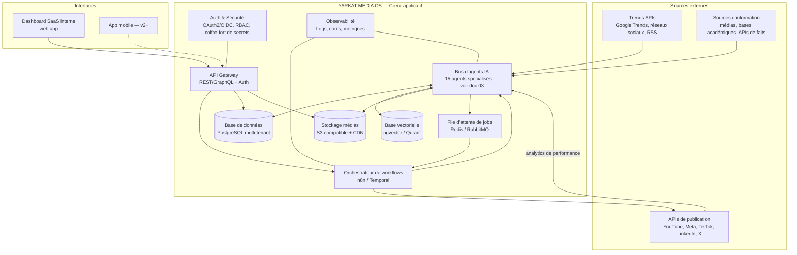
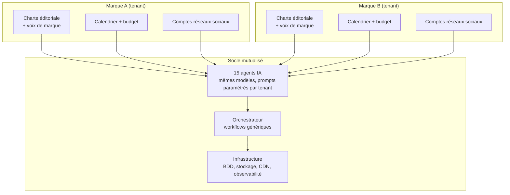

# 2. Architecture système
*Rôle simulé : architecte systèmes / CTO.*

← [Vision stratégique](01-vision-strategique.md) · Suivant → [Agents IA](03-agents-ia.md)

---

## 2.1 Principes directeurs

1. **Multi-tenant dès le premier jour.** Chaque marque (« brand ») est un tenant logique isolé (données, budgets, calendrier, voix de marque) sur une infrastructure partagée. Refactoriser un système mono-marque en multi-marque plus tard coûte 5 à 10× plus cher que de le concevoir ainsi dès le départ.
2. **Orchestration découplée de l'exécution.** Un orchestrateur central (files d'attente + workflows) déclenche des agents IA qui sont des services indépendants et remplaçables (ex. : changer de fournisseur LLM ne doit pas casser le pipeline).
3. **Tout est un événement, tout est journalisé.** Chaque étape du pipeline émet un événement traçable (idempotence, rejouabilité, audit, coût). C'est la condition de l'automatisation à faible intervention humaine (§6) et de la conformité future (AI Act — traçabilité de la génération).
4. **API-first.** Le front-end (dashboard) ne fait jamais d'accès direct à la base : tout passe par l'API interne, pour permettre plus tard une app mobile, une offre en marque blanche, ou des intégrations tierces sans réécrire la logique métier.
5. **Coût et latence maîtrisés par design.** Les opérations coûteuses (génération vidéo/image, montage) sont asynchrones, mises en file, avec plafonds budgétaires par tenant. On ne bloque jamais un utilisateur humain sur un job de 10 minutes.
6. **Open source par défaut, propriétaire par exception.** On privilégie des briques open source auto-hébergeables (base de données, orchestrateur, stockage compatible S3) pour la partie infrastructure "de commodité", et on réserve le budget propriétaire aux briques à forte valeur ajoutée (modèles génératifs) qui n'ont pas d'équivalent open source suffisant en qualité (cf. `05-comparatif-outils.md`).

## 2.2 Vue d'ensemble (schéma d'architecture)

## 2.3 Détail des composants

### 2.3.1 Front-end (Dashboard SaaS interne)

| Aspect | Choix | Justification |
|---|---|---|
| Framework | **Next.js (React) + TypeScript** | 🟢 Écosystème mature, rendu hybride SSR/CSR utile pour un dashboard riche en données temps réel, large vivier de développeurs |
| UI Kit | **Tailwind CSS + shadcn/ui** | 🟢 Composants accessibles, personnalisables par marque (theming multi-tenant) |
| État temps réel | WebSockets / Server-Sent Events depuis l'API | 🟡 Nécessaire pour suivre en direct l'avancement des jobs longs (génération vidéo) |
| Hébergement | **Vercel** (ou Cloudflare Pages en alternative) | 🟢 Déploiement continu simple, CDN global inclus ; cf. comparatif §05 |

Détail fonctionnel complet (dashboard, calendrier éditorial, médiathèque…) dans `07-interface-utilisateur.md`.

### 2.3.2 Back-end / API

| Aspect | Choix | Justification |
|---|---|---|
| Langage/runtime | **Node.js (NestJS/TypeScript)** pour l'API métier ; **Python (FastAPI)** pour les services IA/data | 🟡 NestJS structure bien un backend multi-modules (auth, tenants, facturation) ; Python reste l'écosystème de référence pour l'IA/ML (bibliothèques, SDKs des fournisseurs) |
| Style d'API | **REST** pour les intégrations externes (webhooks plateformes sociales) + **GraphQL** pour le dashboard (requêtes riches, évite le sur/sous-fetching sur des vues complexes comme le calendrier éditorial) | 🟡 Combinaison pragmatique plutôt que dogme « tout GraphQL » ou « tout REST » — détail des schémas en `10-documentation-technique.md` |
| Authentification inter-services | **mTLS ou JWT signés** entre l'orchestrateur et les agents | 🟢 Standard pour architecture orientée services |

### 2.3.3 Orchestration des workflows

C'est la pièce centrale de l'automatisation (détaillée en `06-automatisation.md`).

| Option | Rôle | Quand l'utiliser |
|---|---|---|
| **n8n** (auto-hébergé) | Orchestration visuelle des workflows métier (déclencheurs, branchements, intégrations avec 400+ services) | 🟡 Recommandé pour les workflows éditoriaux (détection sujet → publication) : rapide à itérer, lisible par des non-développeurs, gère nativement webhooks et APIs des réseaux sociaux |
| **Temporal** (ou équivalent : moteur de workflows durable) | Orchestration des chaînes longues et critiques nécessitant des reprises fiables (ex. : génération vidéo en 8 étapes avec retries) | 🟡 À introduire en V2 quand la complexité des reprises après erreur dépasse ce que n8n gère élégamment (cf. `06-automatisation.md` §reprises) |
| **Make (Integromat)** | Alternative SaaS à n8n | 🟢 Plus simple à démarrer sans DevOps, mais coût qui grimpe vite avec le volume et moins de contrôle — voir comparatif chiffré §05 |

🟡 Recommandation : démarrer 100 % sur **n8n auto-hébergé** pour le MVP (coût maîtrisé, contrôle total des données), introduire Temporal uniquement si la V2 le justifie par la complexité réelle observée — ne pas sur-architecturer avant d'avoir le besoin.

### 2.3.4 Bus d'agents IA

Chaque agent (détaillés en `03-agents-ia.md`) est un micro-service stateless qui :
- reçoit une tâche typée depuis la file d'attente,
- appelle un ou plusieurs modèles IA (LLM, génération image/vidéo/voix),
- écrit son résultat en base + stockage médias,
- émet un événement de complétion (succès/échec/coût/durée) vers l'orchestrateur.

Ce découplage permet de **changer de fournisseur de modèle sans toucher au pipeline** (ex. : remplacer un modèle d'image par un autre) — condition indispensable vu la vitesse d'évolution du marché des modèles génératifs.

### 2.3.5 Base de données

| Aspect | Choix | Justification |
|---|---|---|
| Base relationnelle principale | **PostgreSQL** (managé via Supabase ou RDS) | 🟢 Robuste, supporte le multi-tenant par `tenant_id` + Row-Level Security, écosystème mature |
| Base vectorielle | **pgvector** (extension Postgres) au démarrage, **Qdrant** dédié si le volume d'embeddings explose | 🟡 pgvector évite une base séparée tant que le volume reste modéré (recherche de sujets similaires, mémoire des agents, déduplication de contenu) |
| Cache / files | **Redis** | 🟢 Standard pour files d'attente légères, cache de sessions, rate-limiting |
| Modèle de données | Multi-tenant par `tenant_id` sur chaque table + RLS Postgres | 🟢 Isolation des données par marque sans dupliquer l'infrastructure — schéma détaillé en `10-documentation-technique.md` |

### 2.3.6 Stockage et gestion des médias

| Aspect | Choix | Justification |
|---|---|---|
| Stockage objet | **S3-compatible** (Cloudflare R2 ou AWS S3) | 🟡 R2 : pas de frais de sortie (« egress »), critique vu le volume de vidéos ; S3 : écosystème plus large d'outils compatibles |
| CDN | **Cloudflare** | 🟢 Diffusion rapide des médias vers le dashboard et les exports, cache global |
| Médiathèque (catalogage) | Table `assets` en Postgres + métadonnées (résolution, durée, langue, licence, agent générateur, coût) | 🟡 La traçabilité "quel agent/modèle a produit cet asset" est nécessaire pour l'audit qualité ET pour la conformité IA à venir |
| Formats de sortie | Vidéo H.264/H.265 par plateforme (spécifications différentes YouTube/TikTok/Instagram), audio AAC, images WebP/PNG | 🟢 Un service de « rendu final » adapte un master unique aux formats/ratios de chaque canal (16:9, 9:16, 1:1) plutôt que de tout régénérer |

### 2.3.7 Sécurité et authentification

| Aspect | Choix | Détail |
|---|---|---|
| Authentification utilisateurs (dashboard) | **OAuth2/OIDC** via un fournisseur géré (ex. Auth0, Supabase Auth, ou Clerk) | 🟡 Ne pas réimplémenter l'auth soi-même ; SSO nécessaire dès que la holding a plusieurs équipes |
| Autorisation | **RBAC** (rôles : Admin holding, Directeur de marque, Éditeur, Analyste, lecture seule) | 🟡 Détaillé en `10-documentation-technique.md` |
| Secrets (clés API des réseaux sociaux, des modèles IA) | Coffre-fort dédié (**HashiCorp Vault** ou secrets manager du cloud) — jamais en base applicative ni en clair dans les workflows n8n | 🟢 Bonne pratique standard, critique vu le nombre de clés API (10 canaux × N marques) |
| Sécurité applicative | Revue OWASP Top 10 systématique sur l'API, validation stricte des entrées, limitation de débit par tenant | 🟢 Standard |
| Conformité RGPD | Hébergement des données personnelles (commentaires, analytics d'audience) en zone UE si audience européenne majoritaire | 🔴 À confirmer selon la répartition géographique réelle de l'audience visée |

### 2.3.8 Observabilité

| Aspect | Choix | Justification |
|---|---|---|
| Logs structurés | **OpenTelemetry** + backend (Grafana Loki ou équivalent) | 🟢 Standard ouvert, évite le lock-in fournisseur |
| Métriques & coûts | Dashboard FinOps interne (coût par contenu, par agent, par marque, par modèle) | 🟡 Vital : sans ce suivi, le risque « coût API incontrôlé » (§01 risques) devient réel dès le passage à l'échelle |
| Alerting | Seuils sur échecs de pipeline, dépassement de budget, latence anormale | 🟡 Condition de l'automatisation à faible intervention humaine — détaillé en `06-automatisation.md` |

## 2.4 Multi-marque : comment l'isolation fonctionne concrètement

- Chaque marque définit sa **charte éditoriale** (ton, sujets interdits, univers visuel, voix off) sous forme de configuration structurée (JSON — schéma en `10-documentation-technique.md`), consommée par les agents comme paramètre d'entrée.
- Les **budgets et quotas** (API, publication) sont alloués par tenant pour éviter qu'une marque ne consomme le budget d'une autre.
- Le **code et les agents sont partagés à 100 %** : améliorer un agent bénéficie instantanément à toutes les marques.

## 2.5 Choix d'infrastructure cloud — synthèse et arbitrage

| Critère | Cloudflare (Workers/R2/Pages) | Vercel + AWS | Auto-hébergé (VPS + Docker/K8s) |
|---|---|---|---|
| Coût au démarrage | 🟢 Faible (offre généreuse) | 🟡 Moyen | 🟢 Faible mais coût opérationnel humain plus élevé |
| Coût à l'échelle (centaines de contenus/j) | 🟢 Pas de frais d'egress sur R2 = avantage net vu le volume vidéo | 🔴 Frais de sortie AWS S3 significatifs à ce volume | 🟡 Maîtrisé mais nécessite une équipe infra |
| Time-to-market | 🟢 Rapide | 🟢 Rapide | 🔴 Plus lent (setup, maintenance) |
| Contrôle des données / souveraineté | 🟡 Correct | 🟡 Correct | 🟢 Total |
| Verrouillage fournisseur | 🟡 Modéré | 🟡 Modéré | 🟢 Faible |

🟡 **Recommandation** : Cloudflare (R2 + CDN + Workers pour les fonctions légères) pour le stockage/diffusion média, **Vercel** pour le front-end Next.js, **un hébergeur compatible Docker (Hetzner/OVH/Scaleway ou VPS cloud équivalent)** pour l'orchestrateur n8n et les agents IA auto-hébergés. Ce mix évite le tout-AWS (coûts d'egress) sans sacrifier la vélocité de développement. Architecture révisable en V2 si le volume ou les contraintes de conformité l'exigent.

---
← [Vision stratégique](01-vision-strategique.md) · Suivant → [Agents IA](03-agents-ia.md)
