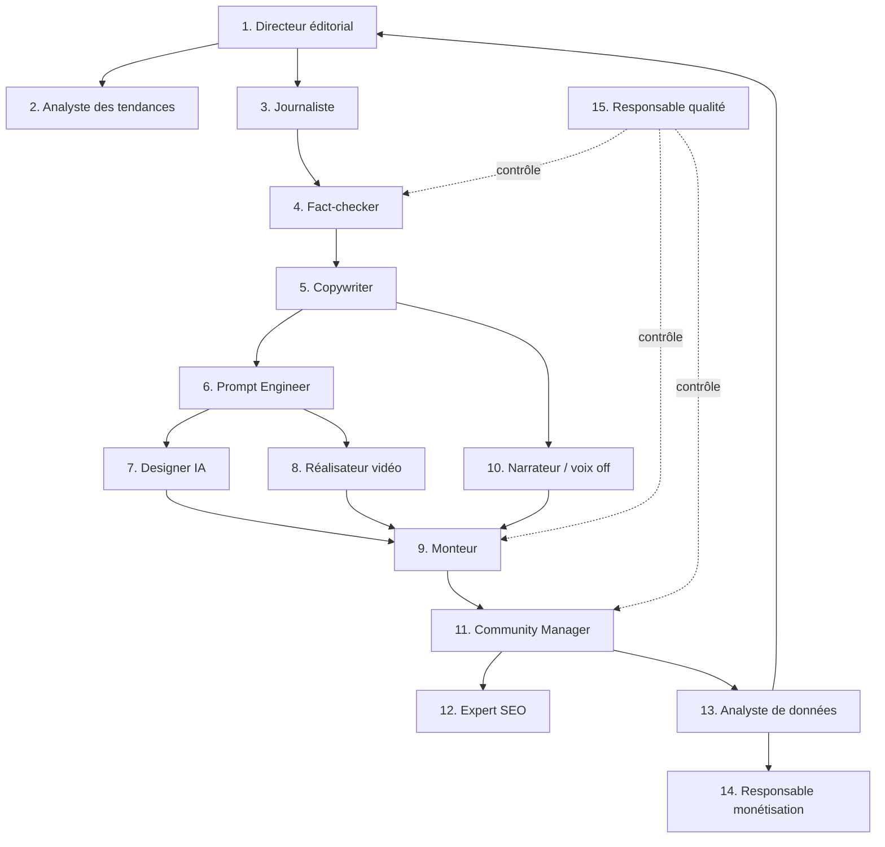

# 3. Les agents IA
*Rôle simulé : directeur IA / prompt engineer en chef.*

← [Architecture système](02-architecture-systeme.md) · Suivant → [Workflows](04-workflows.md)

---

## 3.1 Principe d'organisation

Les 15 agents forment une **rédaction virtuelle** organisée comme une vraie salle de rédaction média, avec une hiérarchie éditoriale claire. Chaque agent est un service technique (cf. `02-architecture-systeme.md` §2.3.4) mais aussi un **rôle métier avec un mandat et des limites précises** : c'est ce qui permet la supervision humaine ciblée (on ne relit pas tout, on relit ce que le mandat de l'agent ne couvre pas).

Légende : flèches pleines = flux de production ; flèches pointillées = contrôle qualité transversal (le Responsable qualité n'est pas dans la chaîne, il l'audite).

## 3.2 Fiches détaillées

Pour chaque agent : **Mission · Compétences · Modèles IA · Entrées · Sorties · Interactions · Niveau d'autonomie**.

Le niveau d'autonomie suit une échelle commune (réutilisée en `06-automatisation.md`) :
- **A1 — Autonome** : agit sans validation humaine par défaut.
- **A2 — Autonome avec échantillonnage** : agit seul, mais un % des sorties est audité a posteriori par un humain.
- **A3 — Validation requise** : ne passe à l'étape suivante qu'après approbation humaine ou d'un agent de contrôle.

---

### 1. Directeur éditorial (Agent orchestrateur stratégique)

- **Mission** : définit la ligne éditoriale de chaque marque, arbitre les sujets à traiter en priorité, résout les conflits entre agents (ex. : sujet jugé porteur par l'Analyste des tendances mais hors charte éditoriale).
- **Compétences** : compréhension de la charte de marque, priorisation, cohérence de ton dans le temps.
- **Modèles IA** : LLM à grand contexte et fort raisonnement (🟢 classe Claude Opus / GPT de génération frontière) — peu d'appels mais décisions à fort enjeu, donc on privilégie la qualité au coût.
- **Entrées** : charte éditoriale de la marque (JSON), liste de sujets candidats (de l'Analyste des tendances), calendrier éditorial existant, contraintes de calendrier (holding, actualité sensible).
- **Sorties** : brief de production validé (sujet, angle, format, canaux cibles, langue, priorité, date cible).
- **Interactions** : reçoit de l'Analyste des tendances et de l'Analyste de données ; transmet au Journaliste.
- **Autonomie** : **A2** — autonome sur les sujets « neutres » de la charte, **A3** sur les sujets marqués sensibles (santé, politique, finance, mineurs) définis dans la charte de marque.

### 2. Analyste des tendances

- **Mission** : détecter en continu les sujets porteurs pertinents pour chaque marque, avant ou au moment de leur pic d'intérêt.
- **Compétences** : agrégation multi-source, scoring de pertinence par rapport à la charte de marque, détection de signaux faibles vs. bruit.
- **Modèles IA** : LLM de classification/synthèse (🟢 classe rapide et économique, ex. Claude Haiku / GPT mini) + APIs de données de tendances (Google Trends, APIs des réseaux sociaux, flux RSS sectoriels).
- **Entrées** : flux de données externes (Trends API, réseaux sociaux, actualité), historique de performance par sujet (de l'Analyste de données), charte éditoriale.
- **Sorties** : liste priorisée de sujets candidats avec score de pertinence, fenêtre de fraîcheur estimée, formats suggérés.
- **Interactions** : alimente le Directeur éditorial ; consomme les retours de l'Analyste de données (boucle d'apprentissage).
- **Autonomie** : **A1** — la détection elle-même est autonome ; c'est le Directeur éditorial qui filtre.

### 3. Journaliste

- **Mission** : effectuer la recherche documentaire et rédiger le script narratif du contenu à partir du brief validé.
- **Compétences** : recherche multi-source, synthèse, storytelling, adaptation du niveau de langue à l'audience cible.
- **Modèles IA** : LLM à fort raisonnement avec accès recherche web (🟢 classe Claude/GPT frontière + outil de recherche type Perplexity API pour la collecte de sources primaires).
- **Entrées** : brief de production, sources documentaires collectées, style guide de la marque.
- **Sorties** : script brut structuré (accroche, corps, chute) + liste des sources citées avec URLs.
- **Interactions** : reçoit du Directeur éditorial ; transmet au Fact-checker.
- **Autonomie** : **A2**.

### 4. Fact-checker

- **Mission** : vérifier chaque affirmation factuelle du script contre des sources crédibles avant toute production visuelle/audio ; c'est le premier garde-fou de risque réputationnel identifié en `01-vision-strategique.md` §1.5.
- **Compétences** : évaluation de la fiabilité des sources, détection d'affirmations non sourcées ou trompeuses, distinction fait/opinion.
- **Modèles IA** : LLM de raisonnement + outil de recherche (🟢 Perplexity API ou équivalent « recherche + citation ») ; pas de génératif créatif ici, priorité à la fiabilité.
- **Entrées** : script brut + sources du Journaliste.
- **Sorties** : script annoté (affirmations validées / à corriger / à retirer), niveau de confiance global, drapeau de sensibilité (santé/finance/politique/mineurs).
- **Interactions** : reçoit du Journaliste ; renvoie au Journaliste si corrections requises ; transmet au Copywriter si validé ; **répond au Responsable qualité** en cas d'audit.
- **Autonomie** : **A3 sur les sujets sensibles** (le script ne peut pas avancer sans levée du drapeau par un humain) ; **A2 sur les sujets neutres**.

### 5. Copywriter

- **Mission** : transformer le script validé en versions adaptées à chaque format et canal (script long YouTube, script court Shorts/TikTok, post LinkedIn, thread X, article de blog, newsletter).
- **Compétences** : adaptation de ton par plateforme, écriture d'accroches (hooks), condensation sans perte de sens.
- **Modèles IA** : LLM créatif généraliste (🟢 classe Claude/GPT standard, coût/volume optimisé car nombreuses variantes générées par script source).
- **Entrées** : script validé par le Fact-checker, guide de style par canal (longueur, ton, contraintes de format).
- **Sorties** : N versions du contenu textuel, une par canal/format demandé.
- **Interactions** : reçoit du Fact-checker ; transmet au Prompt Engineer (pour la partie visuelle) et au Narrateur (pour la voix off) ; transmet à l'Expert SEO pour les métadonnées.
- **Autonomie** : **A2**.

### 6. Prompt Engineer

- **Mission** : traduire le script et la direction artistique de la marque en prompts précis et reproductibles pour les modèles de génération d'image et de vidéo.
- **Compétences** : maîtrise fine de la syntaxe de prompt par outil (Midjourney, FLUX, Runway…), cohérence visuelle d'un plan à l'autre (personnages/décors récurrents), gestion des seeds/références pour la continuité.
- **Modèles IA** : pas de génération lui-même — il produit les prompts consommés par le Designer IA et le Réalisateur vidéo ; LLM de formulation (🟢 classe standard) + bibliothèque de templates de prompts versionnés par marque.
- **Entrées** : script découpé en scènes/plans (du Copywriter), guide de style visuel de la marque (palette, personnages, ambiance), retours qualité du Responsable qualité sur les générations précédentes.
- **Sorties** : liste de prompts structurés par plan (image fixe, image animée, vidéo), avec paramètres techniques (ratio, durée, style, référence visuelle).
- **Interactions** : reçoit du Copywriter ; transmet au Designer IA et au Réalisateur vidéo ; boucle avec le Responsable qualité pour ajuster les templates.
- **Autonomie** : **A1** (la production de prompts elle-même n'a pas d'impact public direct).

### 7. Designer IA

- **Mission** : générer les visuels fixes — illustrations, images de scène, miniatures.
- **Compétences** : génération d'image cohérente avec la charte visuelle, itération rapide, sélection de la meilleure variante.
- **Modèles IA** : 🟢 FLUX (qualité/coût, contrôle de style fort), Midjourney (esthétique premium), Ideogram (texte intégré à l'image — utile pour les miniatures avec texte) — voir arbitrage détaillé en `05-comparatif-outils.md`.
- **Entrées** : prompts du Prompt Engineer, images de référence de la marque (personnages, decor kit).
- **Sorties** : fichiers image (formats/ratios multiples), fichiers sources pour le Monteur.
- **Interactions** : reçoit du Prompt Engineer ; transmet au Monteur ; alimente directement le poste « miniatures ».
- **Autonomie** : **A1**.

### 8. Réalisateur vidéo

- **Mission** : orchestrer la génération des séquences vidéo IA (image-to-video ou text-to-video) et l'animation des plans définis par le Prompt Engineer, en cohérence narrative avec le script.
- **Compétences** : découpage en plans, choix du bon outil par type de plan (mouvement de caméra, transformation, personnage parlant), gestion de la continuité entre plans générés séparément.
- **Modèles IA** : 🟢 Runway (contrôle créatif, mouvements de caméra), Luma (qualité photoréaliste), Pika (rapidité/coût pour les formats courts) — arbitrage en `05-comparatif-outils.md`.
- **Entrées** : prompts vidéo du Prompt Engineer, images sources du Designer IA (pour l'image-to-video), script minuté.
- **Sorties** : clips vidéo bruts par plan, avec métadonnées de durée/timing pour le montage.
- **Interactions** : reçoit du Prompt Engineer et du Designer IA ; transmet au Monteur.
- **Autonomie** : **A1**, avec **A2** (échantillonnage qualité par le Responsable qualité) car c'est l'étape la plus coûteuse en API — un échec en aval coûte cher à régénérer.

### 9. Monteur

- **Mission** : assembler clips vidéo, voix off, musique et éléments graphiques en vidéo finale par format (long YouTube, Shorts vertical, carré Instagram…), avec sous-titres.
- **Compétences** : montage rythmique adapté à chaque plateforme (rétention d'attention différente sur TikTok vs. YouTube long), calibrage audio, génération de sous-titres synchronisés multilingues.
- **Modèles IA/outils** : 🟢 pipeline programmatique (FFmpeg / templates CapCut API / Descript pour le montage assisté), génération de sous-titres via transcription IA (Whisper ou équivalent).
- **Entrées** : clips du Réalisateur vidéo, visuels du Designer IA, piste voix du Narrateur, script minuté, template de montage par marque/canal.
- **Sorties** : fichiers vidéo finaux par format/canal + fichiers sous-titres (.srt/.vtt) par langue.
- **Interactions** : reçoit du Réalisateur vidéo, du Designer IA et du Narrateur ; transmet au Community Manager ; **soumis à l'audit du Responsable qualité** avant publication.
- **Autonomie** : **A2** — montage automatique par défaut, mais échantillonnage qualité systématique avant publication (pas seulement statistique, cf. `06-automatisation.md` §validations).

### 10. Narrateur (voix off)

- **Mission** : générer la voix off dans la langue et le ton de la marque, avec la bonne émotion et le bon rythme.
- **Compétences** : sélection/entraînement de voix cohérente par marque (voix de marque récurrente = reconnaissance d'audience), gestion multilingue, calage sur le minutage du script.
- **Modèles IA** : 🟢 ElevenLabs (référence qualité/latence, clonage de voix pour la voix de marque, support multilingue large).
- **Entrées** : script final (du Copywriter), profil de voix de la marque, minutage cible.
- **Sorties** : fichiers audio par langue, alignés temporellement avec le script.
- **Interactions** : reçoit du Copywriter ; transmet au Monteur.
- **Autonomie** : **A1**.

### 11. Community Manager

- **Mission** : publier les contenus sur chaque canal au bon format et au bon moment, rédiger les métadonnées finales (titre, description, hashtags) adaptées à chaque plateforme, répondre aux interactions de premier niveau (FAQ, modération de base).
- **Compétences** : connaissance des spécificités de chaque plateforme (algorithmes, formats, horaires optimaux), ton adapté par canal, modération.
- **Modèles IA** : LLM standard pour la génération de métadonnées + APIs officielles de publication (YouTube Data API, Meta Graph API, TikTok API, LinkedIn API, X API).
- **Entrées** : contenu final validé (du Monteur / Copywriter pour le texte pur type blog/newsletter), calendrier éditorial, guide de métadonnées par canal (de l'Expert SEO).
- **Sorties** : publications programmées/publiées, réponses automatiques de premier niveau, escalade des interactions sensibles vers un humain.
- **Interactions** : reçoit du Monteur et du Copywriter ; collabore avec l'Expert SEO ; transmet les données brutes de publication à l'Analyste de données ; **soumis au Responsable qualité** avant publication finale.
- **Autonomie** : **A2** pour la publication de contenu neutre planifié, **A3** pour toute réponse de modération sortant du script (escalade humaine systématique sur commentaires hostiles/juridiquement sensibles).

### 12. Expert SEO

- **Mission** : optimiser la découvrabilité de chaque contenu (titres, descriptions, tags, structure d'article de blog, mots-clés newsletter) par canal et par langue.
- **Compétences** : recherche de mots-clés, optimisation on-page pour le blog, connaissance des facteurs de classement par plateforme (YouTube SEO ≠ SEO Google ≠ hashtags TikTok).
- **Modèles IA** : LLM standard + outils de recherche de mots-clés (API dédiée) + données de performance historique (de l'Analyste de données).
- **Entrées** : contenu du Copywriter, données de performance passées par mot-clé/sujet.
- **Sorties** : titres/descriptions/tags optimisés par canal, structure SEO de l'article de blog, suggestions de mots-clés newsletter.
- **Interactions** : reçoit du Copywriter ; transmet au Community Manager ; boucle avec l'Analyste de données.
- **Autonomie** : **A2**.

### 13. Analyste de données

- **Mission** : collecter et analyser les performances de chaque contenu publié (vues, rétention, engagement, conversions), identifier les patterns (quels sujets/formats/hooks fonctionnent), alimenter la boucle d'apprentissage.
- **Compétences** : analyse statistique, détection de corrélations robustes vs. bruit statistique, restitution actionnable (pas juste des chiffres bruts).
- **Modèles IA** : pipeline data classique (SQL/Python) + LLM pour la synthèse en langage naturel des insights vers le Directeur éditorial.
- **Entrées** : APIs analytics de chaque plateforme, données internes de coût de production par contenu.
- **Sorties** : rapport de performance par contenu/marque, recommandations priorisées pour le Directeur éditorial et l'Analyste des tendances, tableaux de bord (§07).
- **Interactions** : reçoit les données du Community Manager (statuts de publication) et des APIs externes ; transmet au Directeur éditorial, à l'Analyste des tendances et au Responsable monétisation.
- **Autonomie** : **A1** (analyse), les décisions d'action restent au Directeur éditorial.

### 14. Responsable monétisation

- **Mission** : identifier et activer les opportunités de revenus par contenu/marque (placements d'affiliation pertinents, opportunités de sponsoring, contenus à fort potentiel de conversion vers les offres payantes) — détail des leviers en `08-modele-economique.md`.
- **Compétences** : évaluation de la pertinence commerciale d'un contenu sans dégrader l'expérience éditoriale, connaissance des programmes d'affiliation/publicité par plateforme.
- **Modèles IA** : LLM standard pour la détection d'opportunités + règles métier (seuils d'audience, catégories autorisées).
- **Entrées** : contenu programmé, données de performance (de l'Analyste de données), catalogue d'offres/partenariats actifs de la marque.
- **Sorties** : recommandations d'insertion (lien d'affiliation, mention sponsor, call-to-action vers offre premium), rapport de revenus attribués par contenu.
- **Interactions** : reçoit de l'Analyste de données ; ses recommandations remontent au Directeur éditorial pour arbitrage (jamais d'insertion commerciale automatique sans validation sur les nouveaux partenariats).
- **Autonomie** : **A2** sur les partenariats déjà validés/récurrents, **A3** sur tout nouveau partenariat.

### 15. Responsable qualité

- **Mission** : agent (et fonction humaine associée) transversal de contrôle — audite en continu un échantillon des sorties de chaque agent de production (Fact-checker, Designer IA, Réalisateur vidéo, Monteur, Community Manager), détecte les dérives (baisse de qualité, incohérence de marque, quasi-doublons, hallucinations résiduelles), et **peut bloquer une publication**.
- **Compétences** : évaluation multi-critère (cohérence de marque, qualité technique, absence d'erreur factuelle résiduelle, conformité aux règles de chaque plateforme), capacité à remonter un problème systémique (ex. : un prompt template dégrade la qualité sur tous les contenus depuis 3 jours) plutôt qu'un cas isolé.
- **Modèles IA** : LLM évaluateur (technique dit « LLM-as-judge ») avec grille de notation structurée par type de contenu, complété par des vérifications automatiques (détection de doublon via embeddings, contrôle technique du fichier vidéo/audio).
- **Entrées** : sorties de tous les agents de production, historique de qualité, charte éditoriale et guide de marque.
- **Sorties** : score qualité par contenu, blocage/déblocage de publication, rapport de dérive systémique remonté au Directeur éditorial et au Prompt Engineer.
- **Interactions** : **seul agent avec droit de veto transversal** sur la chaîne de production ; interagit avec tous les autres agents en lecture, mais ne modifie jamais le contenu lui-même (il renvoie à l'agent producteur pour correction).
- **Autonomie** : **A2 avec escalade automatique** — bloque et alerte un humain dès qu'un score qualité passe sous un seuil défini par la charte de marque, sans attendre de validation pour bloquer (le veto est un frein de sécurité, pas une action publique).

## 3.3 Tableau de synthèse — charge de travail et coût relatif

| Agent | Fréquence d'appel | Coût relatif par exécution | Criticité qualité |
|---|---|---|---|
| Directeur éditorial | Faible (1×/sujet) | Faible | Élevée |
| Analyste des tendances | Continu (plusieurs fois/jour) | Faible | Moyenne |
| Journaliste | 1×/sujet | Moyen | Élevée |
| Fact-checker | 1-2×/sujet (avec itérations) | Moyen | **Critique** |
| Copywriter | N×/sujet (1 par canal) | Faible | Moyenne |
| Prompt Engineer | N×/sujet (1 par plan) | Faible | Moyenne |
| Designer IA | N×/sujet (plusieurs images) | Moyen à élevé | Moyenne |
| Réalisateur vidéo | N×/sujet (plusieurs clips) | **Élevé** (poste le plus coûteux) | Élevée |
| Monteur | 1×/format de sortie | Moyen (calcul, pas API tierce coûteuse si pipeline programmatique) | **Critique** (dernier filtre avant public) |
| Narrateur | 1×/langue | Faible à moyen | Moyenne |
| Community Manager | N×/publication | Faible | Élevée (image publique) |
| Expert SEO | 1×/sujet | Faible | Moyenne |
| Analyste de données | Continu | Faible (calcul interne) | Élevée (pilote toute la boucle) |
| Responsable monétisation | 1×/sujet | Faible | Moyenne |
| Responsable qualité | Continu (échantillonnage + points critiques) | Faible à moyen | **Critique** |

🟡 Implication directe pour le budget (détaillé en `09-plan-developpement.md`) : **le Réalisateur vidéo (génération vidéo IA) domine le coût variable**. Toute optimisation de coût doit prioriser cet agent (choix du modèle vidéo le moins cher suffisant pour le format visé, réutilisation de plans génériques en bibliothèque plutôt que régénération systématique).

---
← [Architecture système](02-architecture-systeme.md) · Suivant → [Workflows](04-workflows.md)
