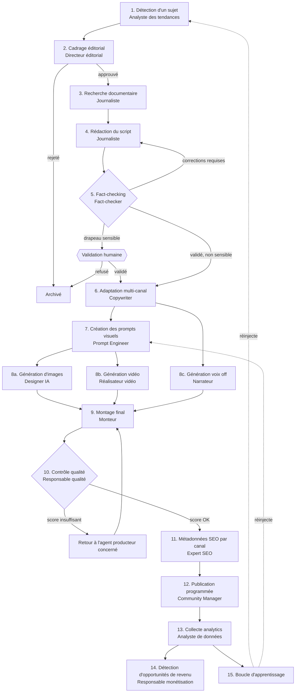
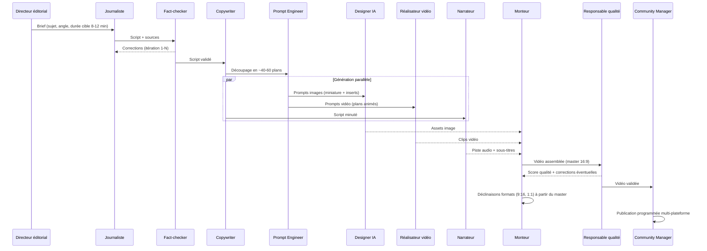
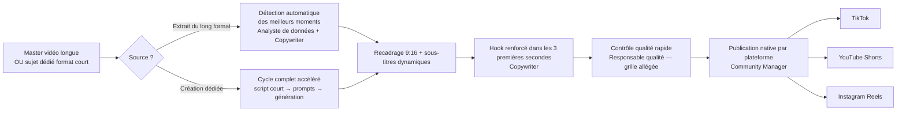
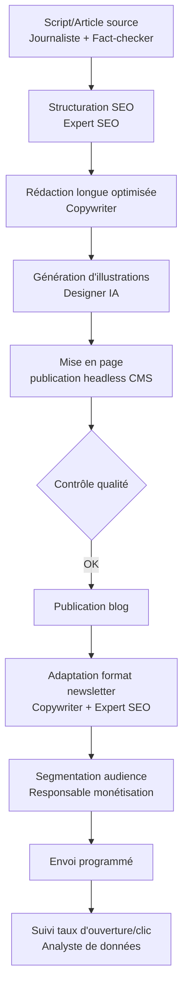
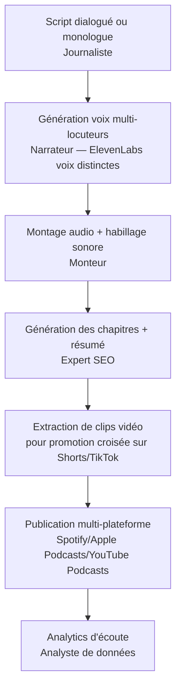
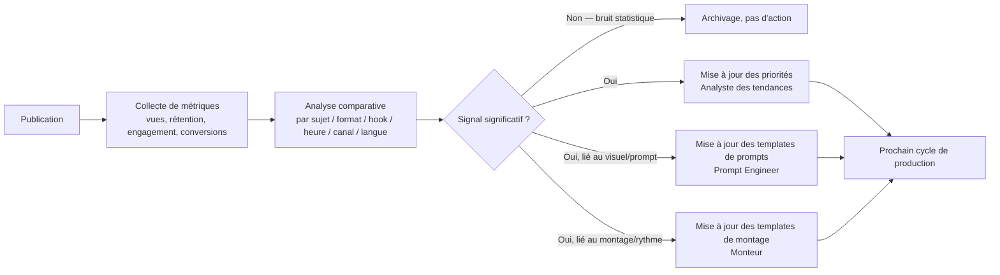

# 4. Les workflows
*Rôle simulé : directeur des opérations.*

← [Agents IA](03-agents-ia.md) · Suivant → [Comparatif des outils](05-comparatif-outils.md)

---

## 4.1 Workflow maître (bout-en-bout)

**Points de contrôle humain obligatoires (non contournables par design, cf. `01-vision-strategique.md` §1.5 et `06-automatisation.md` §validations) :**
1. Sujet marqué sensible par la charte de marque (santé, finance, politique, mineurs) → validation avant script.
2. Score qualité insuffisant après 2 tentatives de correction automatique par le même agent → escalade humaine plutôt que boucle infinie.
3. Nouveau partenariat de monétisation (jamais automatique, cf. `03-agents-ia.md` Responsable monétisation).
4. Réponse de modération sortant du script prédéfini (Community Manager).

## 4.2 Workflow détaillé — Production vidéo longue (YouTube)

🟡 Recommandation : générer un **master unique** (16:9 haute résolution) puis dériver automatiquement les formats verticaux/carrés par recadrage intelligent + reformatage des sous-titres, plutôt que régénérer une vidéo IA distincte par format — c'est le levier de coût le plus direct sur l'agent le plus cher (Réalisateur vidéo, cf. `03-agents-ia.md` §3.3).

## 4.3 Workflow détaillé — Contenu court (Shorts / Reels / TikTok)

🟡 Le format court a une **grille de contrôle qualité allégée** (durée de production plus courte, moindre enjeu réputationnel unitaire) mais **jamais nulle** — le Responsable qualité reste dans la boucle car le volume élevé de shorts est justement ce qui peut faire dériver la marque le plus vite si non supervisé.

## 4.4 Workflow détaillé — Blog + Newsletter (contenu texte long)

## 4.5 Workflow détaillé — Podcast

## 4.6 Boucle d'apprentissage (le workflow le plus stratégique)

🔴 Point de vigilance méthodologique : avec un volume de contenu encore faible (phase MVP/V1), le risque de **sur-interpréter du bruit statistique comme un signal** est réel. Le workflow doit imposer un seuil minimal de données (nombre de publications comparables) avant qu'une recommandation de l'Analyste de données ne modifie automatiquement un template — sinon la boucle d'apprentissage peut dégrader la qualité au lieu de l'améliorer. Détail des seuils en `06-automatisation.md`.

## 4.7 Gestion des reprises après erreur (vue d'ensemble workflow)

Chaque étape du workflow maître (§4.1) est conçue pour être **rejouable indépendamment** :

| Type d'échec | Comportement |
|---|---|
| Échec technique d'un agent (timeout API, erreur modèle) | Retry automatique (backoff exponentiel, 3 tentatives) sans repartir du début du pipeline |
| Échec de qualité (Responsable qualité rejette) | Retour ciblé à l'agent producteur identifié, pas à tout le pipeline |
| Échec de publication (API plateforme indisponible, quota atteint) | Mise en file d'attente avec nouvelle tentative programmée, alerte si échec répété |
| Dérive détectée en boucle d'apprentissage | Pas de reprise automatique — génère une tâche de revue humaine sur le template concerné |

Détail technique complet (files d'attente, idempotence, alerting) en `06-automatisation.md`.

---
← [Agents IA](03-agents-ia.md) · Suivant → [Comparatif des outils](05-comparatif-outils.md)
