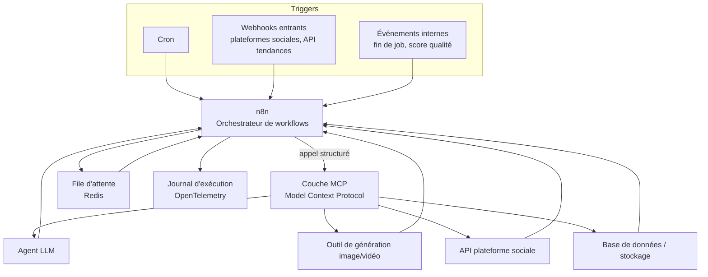
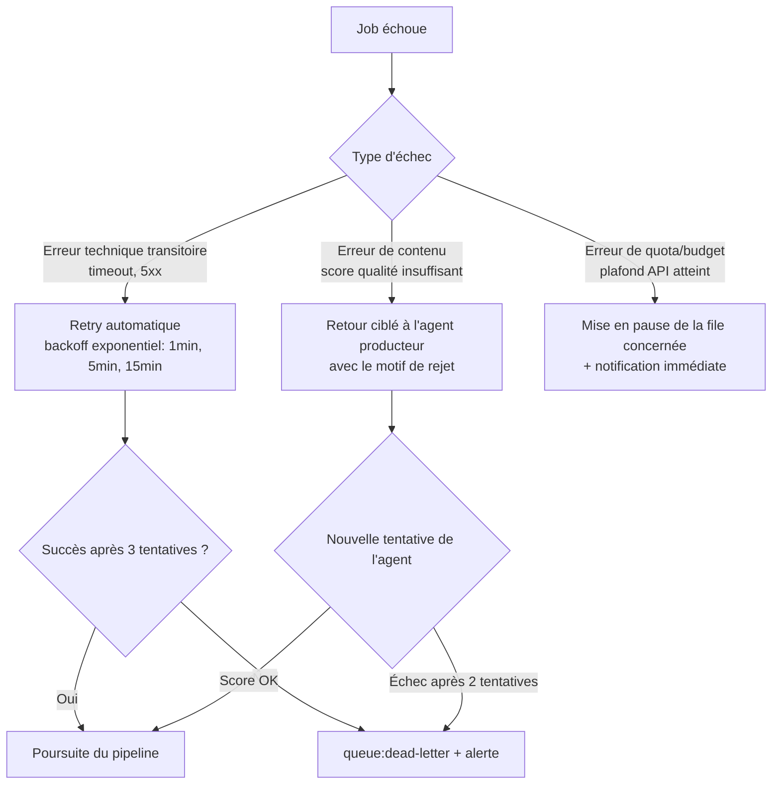

# 6. Automatisation
*Rôle simulé : expert automatisation (n8n / Make / API / MCP).*

← [Comparatif des outils](05-comparatif-outils.md) · Suivant → [Interface utilisateur](07-interface-utilisateur.md)

---

## 6.1 Philosophie : automatiser au maximum, mais avec des freins de sécurité explicites

L'objectif énoncé (« limiter les interventions humaines ») ne veut pas dire « zéro intervention humaine » — cela signifie que **chaque intervention humaine restante doit être délibérée et à forte valeur** (jugement éditorial, arbitrage de risque), jamais une tâche mécanique qu'un agent pourrait faire. Le design ci-dessous suit une règle simple :

> **Automatiser par défaut. Interrompre uniquement sur un signal de risque explicite, jamais « par précaution générale ».**

## 6.2 Déclencheurs (triggers)

| Déclencheur | Type | Exemple |
|---|---|---|
| **Programmé (cron)** | Temporel | L'Analyste des tendances scanne les sources toutes les X heures ; le calendrier éditorial déclenche la production J-3 avant la date de publication cible |
| **Événementiel (webhook entrant)** | Réactif | Un pic soudain de recherche sur un sujet (API de tendances) déclenche une détection hors cycle ; un commentaire reçu déclenche le Community Manager |
| **Basé sur l'état** | Interne | Fin d'un job de génération vidéo → déclenche automatiquement le Monteur ; score qualité insuffisant → déclenche une tâche de correction |
| **Manuel** | Humain | Un directeur de marque insère un sujet prioritaire directement dans le calendrier éditorial (§07) |

## 6.3 Rôle de n8n, MCP et des agents



- **n8n** orchestre le *quoi/quand* (la logique de workflow métier : branchements, conditions, planification).
- **MCP (Model Context Protocol)** standardise le *comment* : chaque agent expose ses capacités (outils) via une interface commune, ce qui permet à n8n (ou à un agent superviseur) d'appeler indifféremment un LLM, un générateur d'image ou une API de publication sans coder une intégration ad hoc pour chacun. 🟡 C'est ce qui rend l'architecture agents réellement modulaire (cf. `02-architecture-systeme.md` §2.1) : ajouter un nouvel outil de génération vidéo = ajouter un serveur MCP, pas réécrire le workflow n8n.
- Les **agents** (`03-agents-ia.md`) sont les unités d'exécution ; ils ne connaissent pas l'orchestration globale, seulement leur tâche.

## 6.4 Files d'attente

| File | Rôle | Politique |
|---|---|---|
| `queue:trends-detection` | Sujets candidats à traiter | FIFO, dédupliquée par similarité (embeddings, pour éviter deux sujets quasi identiques) |
| `queue:script-production` | Scripts en cours de rédaction/fact-check | Priorité par urgence éditoriale (actualité chaude > contenu evergreen) |
| `queue:media-generation` | Jobs de génération image/vidéo/voix | **File à concurrence limitée par budget** — voir §6.7 ; priorité par deadline de publication |
| `queue:assembly` | Jobs de montage | FIFO, avec réservation des assets nécessaires déjà générés |
| `queue:publication` | Publications programmées | Ordonnancée par créneau horaire optimal par canal (déterminé par l'Expert SEO/Analyste de données) |
| `queue:dead-letter` | Jobs ayant échoué après épuisement des tentatives | Jamais silencieuse — génère systématiquement une alerte (§6.9) |

🟡 Recommandation technique : Redis (listes/streams) suffit pour le MVP et la V1 ; si la complexité des reprises partielles (ex. : reprendre un montage après échec sans regénérer les clips déjà réussis) dépasse ce que Redis+n8n gèrent proprement, migrer les jobs longs vers un moteur de workflow durable (Temporal, cf. `02-architecture-systeme.md` §2.3.3) en V2.

## 6.5 Validations automatiques vs. validations humaines

| Étape | Validation automatique | Validation humaine requise |
|---|---|---|
| Sélection de sujet | Score de pertinence ≥ seuil défini par la charte de marque | Si sujet marqué « sensible » par la charte (santé, finance, politique, mineurs) |
| Fact-checking | Score de confiance ≥ seuil, sources ≥ 2 indépendantes et crédibles | Si score < seuil après 2 itérations de correction, ou sujet sensible |
| Génération visuelle | Détection automatique d'anomalies techniques (visage déformé, texte illisible, artefacts) | Aucune par défaut sur les sujets neutres ; échantillonnage aléatoire par le Responsable qualité |
| Montage final | Contrôle technique (durée, format, présence de sous-titres, niveau audio) | Score qualité éditoriale (LLM-as-judge) sous seuil → blocage automatique + revue humaine |
| Publication | Conformité aux règles techniques de chaque plateforme (durée, ratio, taille de fichier) | Nouveau canal jamais utilisé pour cette marque (première publication toujours supervisée) |
| Réponse aux commentaires | Réponses de premier niveau (FAQ pré-approuvées) | Tout commentaire hors script, hostile, ou juridiquement sensible |
| Monétisation | Application d'un partenariat déjà validé et récurrent | Tout nouveau partenariat ou nouvelle catégorie de produit affilié |

Ce tableau est la traduction opérationnelle des niveaux d'autonomie A1/A2/A3 définis en `03-agents-ia.md` §3.2 — **chaque seuil est un paramètre de la charte éditoriale de la marque**, pas une constante globale : une marque « finance patrimoniale » de la holding aura des seuils plus stricts qu'une marque de divertissement grand public.

## 6.6 Reprises après erreur

Principe : **rejouable à l'étape, jamais depuis le début** (cf. `04-workflows.md` §4.7).



**Idempotence** : chaque job porte un identifiant unique (`content_id` + `step`) ; rejouer un job déjà réussi ne le régénère pas (vérification systématique de l'état avant exécution) — indispensable pour éviter de payer deux fois une génération vidéo en cas de retry mal maîtrisé.

## 6.7 Garde-fous budgétaires (FinOps automatisé)

| Garde-fou | Mécanisme |
|---|---|
| Plafond de dépense par marque/jour | Le job de génération est refusé (mis en attente, pas perdu) si le plafond du tenant est atteint ; alerte au Directeur éditorial de la marque |
| Plafond de dépense par agent | Empêche qu'un agent en boucle d'erreur (ex. Réalisateur vidéo régénérant sans fin) ne consomme tout le budget |
| Coût estimé avant exécution | Pour les jobs coûteux (vidéo), un calcul d'estimation de coût est fait avant lancement et comparé au budget restant |
| Alerte de dérive | Si le coût moyen par contenu dérive de plus de X % sur 7 jours glissants, alerte à l'Analyste de données et au Directeur éditorial |

Ce mécanisme répond directement au risque « coût API incontrôlé » identifié en `01-vision-strategique.md` §1.5.

## 6.8 Journalisation (logs)

Chaque événement du pipeline (§04) écrit une entrée structurée contenant a minima :

```json
{
  "event_id": "uuid",
  "tenant_id": "brand-xyz",
  "content_id": "uuid",
  "step": "video_generation",
  "agent": "realisateur-video",
  "model_used": "provider/model-name",
  "status": "success | failure | retried",
  "duration_ms": 48210,
  "cost_estimate_eur": 1.42,
  "quality_score": 0.87,
  "timestamp": "2026-09-09T12:00:00Z"
}
```

🟡 Ce format est la base de : (a) l'observabilité technique (§02), (b) le dashboard FinOps (§07), (c) la traçabilité de conformité IA (quel modèle a produit quoi, exigible par certaines réglementations à venir — cf. `01-vision-strategique.md` §1.5). Le concevoir dès le MVP évite une dette de conformité coûteuse plus tard.

## 6.9 Notifications

| Canal | Usage |
|---|---|
| Dashboard (in-app) | File d'attente des validations humaines en attente (§07) |
| Email/Slack (équipe) | Alerte dépassement de budget, échec en `dead-letter`, dérive qualité détectée |
| Escalade directe (SMS/appel — cas critiques uniquement) | Incident de publication en cours (ex. : contenu erroné déjà publié) — nécessite intervention immédiate |

🟡 Recommandation : router toutes les notifications non critiques vers un canal unique consolidé (ex. un salon Slack dédié « YARKAT MEDIA OS — Alertes ») plutôt que de multiplier les canaux, pour éviter la fatigue d'alerte qui conduit à ignorer les vraies urgences.

## 6.10 Ce qui ne sera jamais 100 % automatisé (et pourquoi c'est un choix, pas une limite technique)

- **Le cadrage stratégique initial d'une nouvelle marque** (charte éditoriale, ligne rouge de contenu) : décision humaine fondatrice, non déléguée.
- **La validation des sujets sensibles** : risque réputationnel asymétrique (un mauvais contenu peut coûter plus cher que des centaines de bons contenus ne rapportent).
- **Les nouveaux partenariats de monétisation** : engagement contractuel/commercial, pas une tâche de production.

🟡 Ce choix est délibéré et documenté ici pour que l'équipe ne cherche pas, sous pression de volume, à automatiser ces trois points — ce serait le chemin le plus court vers le risque réputationnel identifié en `01-vision-strategique.md`.

---
← [Comparatif des outils](05-comparatif-outils.md) · Suivant → [Interface utilisateur](07-interface-utilisateur.md)
