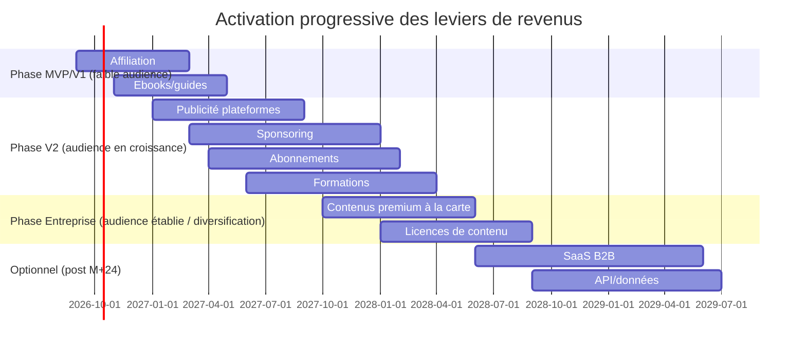

# 8. Modèle économique et monétisation
*Rôle simulé : CFO / stratège monétisation.*

← [Interface utilisateur](07-interface-utilisateur.md) · Suivant → [Plan de développement](09-plan-developpement.md)

---

> ⚠️ Tous les chiffres de ce document sont des **scénarios de modélisation 🔴**, construits à partir d'hypothèses de conversion et de tarification explicitées à chaque tableau — **pas des prévisions engageantes**. Ils servent à raisonner sur la structure économique (quel levier pèse, à quel volume), pas à produire un business plan financier définitif.

## 8.1 Les 10 leviers de revenus

| # | Levier | Description dans le contexte YARKAT MEDIA OS | Vitesse d'activation | Dépendance à l'audience |
|---|---|---|---|---|
| 1 | **Publicité** (AdSense YouTube, Ad Breaks Meta/TikTok Creator Fund) | Monétisation native des plateformes sur le contenu vidéo/social | Rapide (dès les seuils d'éligibilité atteints) | Forte — nécessite un volume de vues significatif |
| 2 | **Affiliation** | Liens produits/services pertinents insérés par le Responsable monétisation (§03) dans description/article/newsletter | Rapide | Moyenne — fonctionne dès une audience qualifiée, même modeste |
| 3 | **Formations** | Cours/ateliers premium sur les sujets d'expertise de chaque marque (ex. : marque finance → formation gestion patrimoniale) | Moyenne (nécessite un produit à concevoir) | Moyenne — audience de niche suffit si haute confiance |
| 4 | **Ebooks / guides premium** | Compilation éditorialisée de contenus existants + contenu exclusif, vendus ou en lead magnet | Rapide (réutilise du contenu déjà produit) | Faible |
| 5 | **SaaS** (licence de YARKAT MEDIA OS à des tiers) | Vente de la plateforme elle-même à d'autres éditeurs — Couche 2 du modèle (`01-vision-strategique.md` §1.3) | Lente — nécessite maturité produit | Nulle (indépendant de l'audience média) |
| 6 | **Abonnements** | Contenu exclusif, communauté privée, avantages premium par marque | Moyenne | Moyenne à forte — nécessite une base d'audience engagée |
| 7 | **Sponsoring** | Partenariats de marque intégrés éditorialement (mentions, contenus dédiés) | Moyenne (nécessite démarchage commercial) | Forte — les sponsors regardent l'audience et l'engagement |
| 8 | **Licences de contenu** | Revente de droits d'usage de contenus/formats à d'autres médias ou marques de la holding | Lente | Faible à moyenne |
| 9 | **Contenus premium à la carte** | Micro-paiement pour un contenu spécifique (rapport approfondi, épisode bonus) | Moyenne | Moyenne |
| 10 | **API / données** | Exposer en marque blanche les insights de tendances/performance agrégés (produit dérivé de l'Analyste de données) | Lente | Nulle (produit data, pas média) |

## 8.2 Séquencement recommandé par phase

🟡 **Recommandation** : n'activer un levier qu'après avoir un volume/qualité d'audience qui le rend crédible — un sponsoring proposé trop tôt (faible audience) dévalorise la marque et complique la négociation future. L'affiliation et les ebooks (leviers 2 et 4) sont recommandés en premier car ils ne dépendent pas d'un volume d'audience minimal.

## 8.3 Hypothèses de modélisation (à valider/ajuster)

| Paramètre | Hypothèse retenue 🔴 | Base de l'hypothèse |
|---|---|---|
| Coût moyen de production par contenu long (vidéo YouTube) | 6 à 10 € | Somme des coûts agents (§03 §3.3) : génération vidéo dominante, estimée sur les tarifs indicatifs `05-comparatif-outils.md` |
| Coût moyen de production par contenu court (Short/Reel/TikTok) | 0,50 à 1,50 € | Génération vidéo réduite (Pika, plans courts), montage automatisé |
| Coût moyen de production par article de blog/newsletter | 0,20 à 0,50 € | Essentiellement coût LLM texte, peu de génératif visuel |
| Taux de conversion audience → revenu affiliation | 0,5 à 2 % des vues qualifiées | Analogie avec des benchmarks sectoriels grand public d'affiliation média — 🔴 fortement dépendant de la niche et non vérifié pour ce projet spécifique |
| RPM publicitaire (revenu pour 1000 vues) | 1 à 4 € selon plateforme/marché | 🔴 Fourchette large observée sur le marché de la création de contenu généraliste ; varie fortement par pays d'audience et catégorie |

## 8.4 Scénario A — Conservateur (1 marque pilote, fin d'année 1)

| Indicateur | Valeur | Calcul |
|---|---|---|
| Contenus longs/mois | 20 | Hypothèse de cadence MVP (`09-plan-developpement.md`) |
| Contenus courts/mois | 60 | 3 déclinaisons courtes par contenu long en moyenne |
| Coût de production/mois | ≈ 20×8 € + 60×1 € ≈ **220 €** | Milieu de fourchette §8.3 |
| Coût infrastructure/mois | ≈ **150 €** | Hébergement + orchestration + LLM hors génératif lourd |
| **Coût total/mois** | **≈ 370 €** | |
| Revenus affiliation + ebooks | ≈ **150 à 400 €** | Hypothèse basse de conversion, audience naissante |
| **Résultat mensuel** | **-220 € à +30 €** | Phase d'investissement, résultat attendu proche de l'équilibre ou légèrement négatif |

## 8.5 Scénario B — Croissance maîtrisée (3-6 marques, fin d'année 2)

| Indicateur | Valeur | Calcul |
|---|---|---|
| Contenus longs/mois (portefeuille) | 150 (25/marque × 6) | |
| Contenus courts/mois (portefeuille) | 450 | |
| Coût de production/mois | ≈ 150×8 € + 450×1 € ≈ **1 650 €** | |
| Coût infrastructure/mois | ≈ **600 €** | Mutualisation partielle (avantage multi-tenant, §02) |
| **Coût total/mois** | **≈ 2 250 €** | |
| Revenus (affiliation + pub + sponsoring naissant + abonnements) | ≈ **2 000 à 6 000 €** | Fourchette large — dépend fortement du succès des 2-3 marques les plus performantes (loi de Pareto habituelle en média) |
| **Résultat mensuel** | **-250 € à +3 750 €** | Rentabilité possible mais non garantie — dépend de la performance des marques individuelles, pas de la moyenne du portefeuille |

🟡 Enseignement clé de ce scénario : **la rentabilité du portefeuille dépendra probablement de 1 à 2 marques qui surperforment**, pas d'une moyenne homogène — c'est la raison pour laquelle `01-vision-strategique.md` §1.7 recommande une porte de décision annuelle qui réalloue les ressources vers ce qui fonctionne.

## 8.6 Scénario C — Échelle industrielle (portefeuille élargi, année 3)

| Indicateur | Valeur | Calcul |
|---|---|---|
| Contenus/jour (portefeuille) | 100 à 300 | Cible « centaines de contenus/jour » de la demande d'origine |
| Coût de production/mois | ≈ **8 000 à 25 000 €** | Extrapolation linéaire des coûts unitaires §8.3 — 🔴 suppose que le coût marginal par contenu ne baisse pas davantage ; en réalité, la réutilisation d'assets (`04-workflows.md` §4.2) et la négociation de tarifs API en volume devraient le faire baisser |
| Coût infrastructure/mois | ≈ **2 000 à 4 000 €** | Infra mutualisée, montée en charge par paliers |
| Revenus multi-leviers (portefeuille mature) | 🔴 **Non chiffrable de façon fiable à ce stade** | Dépend de facteurs non modélisables à 3 ans (algorithmes des plateformes, saturation de niches, évolution réglementaire) |

🔴 **Avertissement explicite** : contrairement aux scénarios A et B, le scénario C ne présente pas d'estimation de revenus chiffrée car l'incertitude à cet horizon est trop grande pour qu'un chiffre ait une valeur informative — l'afficher créerait une fausse précision. Ce que le scénario établit, c'est l'**ordre de grandeur du coût opérationnel** à ce volume, qui doit être confronté trimestriellement à la performance réelle observée (cf. rituel de pilotage en `09-plan-developpement.md`).

## 8.7 Indicateurs à suivre en priorité (avant tout chiffre de revenu)

1. **Coût par contenu publié**, en baisse continue attendue avec l'apprentissage (§04 boucle d'apprentissage) et la réutilisation d'assets.
2. **Taux d'intervention humaine par contenu** (temps humain / contenu) — doit baisser avec la maturité des templates de prompts.
3. **Taux de conversion réel par levier de monétisation**, mesuré marque par marque dès les premiers mois — remplace les hypothèses 🔴 du §8.3 par des données propriétaires dès que possible.
4. **Concentration de la performance** (part du CA générée par la marque #1 du portefeuille) — signal d'alerte si elle dépasse ~70 %, indiquant une dépendance excessive à une seule marque.

---
← [Interface utilisateur](07-interface-utilisateur.md) · Suivant → [Plan de développement](09-plan-developpement.md)
