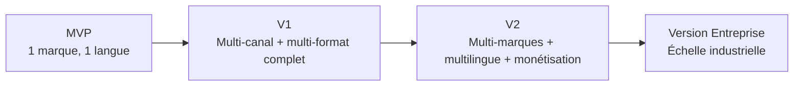

# 9. Plan de développement
*Rôle simulé : directeur de programme.*

← [Modèle économique](08-modele-economique.md) · Suivant → [Documentation technique](10-documentation-technique.md)

---

## 9.1 Découpage en versions

Chaque version se termine par une **porte de décision go/no-go** (cf. `01-vision-strategique.md` §1.7) — le calendrier ci-dessous est une hypothèse de rythme, pas un engagement, révisable trimestriellement.

## 9.2 MVP — Preuve de concept (mois 1 à 4)

**Objectif** : prouver que le pipeline bout-en-bout fonctionne sur une seule marque, sans encore chercher l'échelle.

| Fonctionnalités incluses | Fonctionnalités explicitement exclues |
|---|---|
| 1 marque, 1 langue (FR recommandé pour commencer) | Multi-marque (architecture prête, mais un seul tenant actif) |
| Workflow maître complet (`04-workflows.md` §4.1) mais avec **plus de points de validation humaine** que la cible V1 | Sponsoring/formations/SaaS (§08) |
| Canaux : YouTube + YouTube Shorts + Blog (3 canaux, pas 10) | LinkedIn, X, TikTok, Facebook, Instagram, Podcast, Newsletter |
| 8 agents actifs sur 15 : Directeur éditorial, Analyste des tendances, Journaliste, Fact-checker, Copywriter, Prompt Engineer, Designer IA, Monteur | Réalisateur vidéo IA complet (le MVP peut utiliser des visuels animés simples plutôt que de la génération vidéo IA coûteuse, pour valider l'économie avant d'engager le poste de coût le plus élevé) |
| Dashboard minimal : calendrier + file des exceptions + coûts | Analytics avancé, performance des agents détaillée |
| n8n auto-hébergé, Supabase, Cloudflare R2 | Temporal, base vectorielle dédiée (pgvector suffit) |

| Ressources nécessaires | Détail |
|---|---|
| Équipe | 1 lead développeur full-stack, 1 développeur IA/automatisation (prompt engineering + intégrations), 1 responsable éditorial (mi-temps, joue le rôle de « Directeur éditorial humain » le temps que l'agent soit calibré) |
| Budget technique | 🔴 **≈ 3 000 à 6 000 €** sur 4 mois (infra + API génératives en phase de test/calibration, hors salaires) — hypothèse basée sur un volume de test de quelques dizaines de contenus/mois, cf. `08-modele-economique.md` §8.4 |
| Budget humain | Hors périmètre chiffré ici (dépend des conditions de rémunération internes à la holding) |
| Délai | 4 mois |

**Risques spécifiques au MVP** : sous-estimer le temps de calibration des prompts (le premier mois produit probablement des contenus de qualité insuffisante — c'est attendu, pas un échec) ; vouloir couvrir trop de canaux trop tôt et diluer l'effort de calibration.

**Critères de sortie (go vers V1)** :
- [ ] Au moins 20 contenus longs publiés avec un taux de correction humaine décroissant sur la période.
- [ ] Coût par contenu mesuré et documenté (base de comparaison pour la suite).
- [ ] Aucun incident réputationnel (erreur factuelle publiée, contenu inapproprié).
- [ ] Le Responsable qualité (agent) bloque effectivement les contenus sous le seuil défini (preuve que le garde-fou fonctionne, pas seulement qu'il existe).

## 9.3 V1 — Industrialisation mono-marque (mois 5 à 10)

**Objectif** : couvrir l'intégralité des canaux et formats sur la marque pilote, avant de dupliquer sur d'autres marques.

| Fonctionnalités ajoutées |
|---|
| Les 10 canaux complets : + Facebook, Instagram, TikTok, LinkedIn, X, Podcast, Newsletter |
| Les 15 agents actifs, y compris Réalisateur vidéo (génération vidéo IA complète) et Narrateur (ElevenLabs) |
| Automatisation complète des reprises après erreur et des files d'attente (`06-automatisation.md`) |
| Dashboard complet : médiathèque, analytics, performance des agents |
| Ajout d'une 2ᵉ langue (EN) sur la marque pilote pour valider le pipeline multilingue avant de l'appliquer à d'autres marques |
| Activation des premiers leviers de monétisation : affiliation, ebooks (§08 §8.2) |

| Ressources nécessaires | Détail |
|---|---|
| Équipe | Équipe MVP + 1 développeur supplémentaire (intégrations plateformes sociales, souvent le poste le plus chronophage : chaque API a ses spécificités) |
| Budget technique | 🔴 **≈ 8 000 à 15 000 €** sur 6 mois (volume de production en forte hausse, tous les postes de génération actifs) |
| Délai | 6 mois |

**Critères de sortie (go vers V2)** :
- [ ] Publication automatisée fonctionnelle sur les 10 canaux sans intervention manuelle répétitive.
- [ ] Coût par contenu en baisse mesurable par rapport au MVP (preuve que la boucle d'apprentissage et la réutilisation d'assets fonctionnent).
- [ ] Pipeline multilingue (FR/EN) validé sans dégradation de qualité perçue.
- [ ] Au moins 1 levier de monétisation générant un revenu mesurable (même modeste).

## 9.4 V2 — Portefeuille multi-marques (mois 11 à 18)

**Objectif** : dupliquer le succès sur plusieurs marques et compléter la couverture linguistique.

| Fonctionnalités ajoutées |
|---|
| Activation de 2 à 5 marques supplémentaires sur le socle multi-tenant (déjà prévu dans l'architecture dès le MVP, cf. `02-architecture-systeme.md` §2.4) |
| Langues ES et AR (support RTL pour l'arabe — impact sur le montage/sous-titrage et sur le dashboard) |
| Monétisation élargie : sponsoring, abonnements, formations (§08) |
| Montée en robustesse de l'orchestration (évaluation de Temporal si la complexité des reprises le justifie, cf. `02-architecture-systeme.md` §2.3.3) |
| Vue comparative multi-marques dans le dashboard (§07) |
| Renforcement du Responsable qualité : détection de dérive systémique inter-marques |

| Ressources nécessaires | Détail |
|---|---|
| Équipe | Équipe V1 + 1 responsable éditorial par marque active (rôle humain de supervision, pas de développement) + 1 chargé de partenariats (sponsoring/affiliation) |
| Budget technique | 🔴 **≈ 20 000 à 45 000 €** sur 8 mois (multiplié par le nombre de marques actives, mais avec un coût marginal par marque décroissant grâce à la mutualisation) |
| Délai | 6 à 8 mois |

**Risques spécifiques à la V2** : dupliquer trop vite sans que le coût par contenu ait réellement baissé sur la marque pilote (cf. critère de sortie V1) — le risque principal de cette phase est de **répliquer une inefficacité à grande échelle** plutôt que de répliquer un succès.

**Critères de sortie (go vers Version Entreprise)** :
- [ ] Au moins 1 marque atteint un seuil de rentabilité unitaire (§08 §8.7).
- [ ] Le support RTL/arabe ne dégrade pas la qualité perçue (validation humaine dédiée, l'équipe de calibration initiale n'étant probablement pas arabophone).
- [ ] L'équipe peut opérer le système sans dépendance critique à 1-2 personnes (documentation à jour, cf. `10-documentation-technique.md`).

## 9.5 Version Entreprise — Échelle industrielle (mois 19+)

**Objectif** : atteindre des centaines de contenus/jour à l'échelle du portefeuille, avec une infrastructure et une gouvernance à la hauteur.

| Fonctionnalités ajoutées |
|---|
| Montée en charge infrastructure (passage éventuel de n8n mono-instance à une architecture distribuée, migration des jobs critiques vers Temporal) |
| FinOps avancé : négociation de tarifs API en volume, arbitrage automatique multi-fournisseur par coût/qualité (§05 §5.8) |
| Gouvernance de conformité formalisée (traçabilité IA, revue juridique des obligations de transparence par marché — cf. `01-vision-strategique.md` §1.5) |
| Option d'ouverture de la Couche 2 (licence SaaS B2B) si la décision stratégique est prise (§08 §8.2) |
| Élargissement linguistique au-delà de FR/EN/ES/AR selon opportunités identifiées par l'Analyste des tendances |

| Ressources nécessaires | Détail |
|---|---|
| Équipe | Équipe technique élargie (SRE/DevOps dédié), équipe éditoriale par marque, fonction juridique/conformité (interne ou externalisée) |
| Budget technique | 🔴 Cf. Scénario C, `08-modele-economique.md` §8.6 — **≈ 10 000 à 30 000 €/mois** en coûts opérationnels à ce volume |
| Délai | Continu — cette phase n'a pas de fin, elle devient le régime de croisière |

## 9.6 Rituel de pilotage recommandé

🟡 Indépendamment du découpage en versions, mettre en place dès le MVP :

- **Revue hebdomadaire** : file des exceptions, incidents qualité, dérive de coût (opérationnel).
- **Revue mensuelle** : performance par marque, avancement des critères de sortie de version (tactique).
- **Revue trimestrielle** : porte de décision go/no-go stratégique (cf. `01-vision-strategique.md` §1.7), réallocation des ressources entre marques selon la performance réelle.

## 9.7 Synthèse budgétaire indicative (technique uniquement, hors salaires)

| Version | Durée | Budget technique estimé 🔴 | Cumulé |
|---|---|---|---|
| MVP | 4 mois | 3 000 – 6 000 € | 3 000 – 6 000 € |
| V1 | 6 mois | 8 000 – 15 000 € | 11 000 – 21 000 € |
| V2 | 6-8 mois | 20 000 – 45 000 € | 31 000 – 66 000 € |
| Entreprise | continu | 10 000 – 30 000 €/mois | — |

🔴 Cette synthèse **exclut les salaires/rémunérations**, qui dépendent des choix internes de la holding (embauche, prestataires, temps partiel) et n'ont pas été demandés dans le périmètre de ce dossier — à compléter séparément avant toute décision de financement.

---
← [Modèle économique](08-modele-economique.md) · Suivant → [Documentation technique](10-documentation-technique.md)
