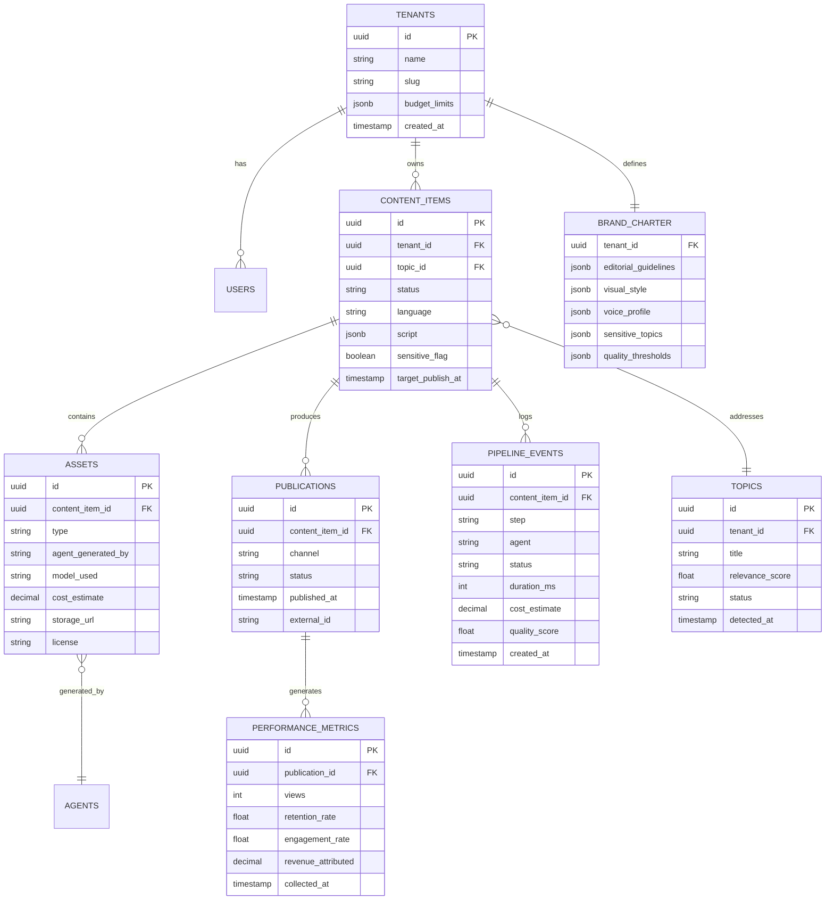

# 10. Documentation technique
*Rôle simulé : lead développeur.*

← [Plan de développement](09-plan-developpement.md) · Suivant → [Améliorations futures](11-ameliorations-futures.md)

---

## 10.1 Organisation des dossiers (monorepo recommandé)

🟡 Recommandation : **monorepo** plutôt que multi-repo — les agents, l'orchestrateur et le dashboard évoluent souvent ensemble (ex. : nouveau champ de charte éditoriale = impact front + agents + schéma de données) ; un monorepo évite la synchronisation de versions entre repos séparés.

```
yarkat-media-os/
├── apps/
│   ├── dashboard/                 # Next.js — interface SaaS interne (§07)
│   ├── api-gateway/                # NestJS — API REST/GraphQL (§10.5)
│   └── public-blog/                # Rendu public du blog par marque (headless)
├── services/
│   ├── orchestrator/                # Config n8n versionnée (workflows exportés en JSON)
│   ├── agents/
│   │   ├── directeur-editorial/
│   │   ├── analyste-tendances/
│   │   ├── journaliste/
│   │   ├── fact-checker/
│   │   ├── copywriter/
│   │   ├── prompt-engineer/
│   │   ├── designer-ia/
│   │   ├── realisateur-video/
│   │   ├── monteur/
│   │   ├── narrateur/
│   │   ├── community-manager/
│   │   ├── expert-seo/
│   │   ├── analyste-donnees/
│   │   ├── responsable-monetisation/
│   │   └── responsable-qualite/
│   │       ├── src/
│   │       ├── prompts/            # Templates de prompts versionnés (voir §10.3)
│   │       └── tests/
│   └── mcp-connectors/              # Serveurs MCP par outil externe (FLUX, Runway, ElevenLabs, APIs sociales...)
├── packages/
│   ├── shared-types/                 # Types TypeScript partagés (contrats d'événements, DTO)
│   ├── db-schema/                    # Migrations Postgres (Drizzle/Prisma) + schéma RLS multi-tenant
│   └── ui-kit/                       # Composants partagés du dashboard (theming multi-marque)
├── infra/
│   ├── docker/
│   ├── terraform/                    # Provisioning infra (Cloudflare, hébergement agents)
│   └── ci-cd/
├── docs/
│   └── plateforme-media-ia/          # Ce dossier de conception
└── tests/
    └── e2e/                          # Tests bout-en-bout du pipeline (§10.4)
```

## 10.2 Conventions de nommage

| Élément | Convention | Exemple |
|---|---|---|
| Dossiers/fichiers | `kebab-case` | `fact-checker`, `content-calendar.tsx` |
| Variables/fonctions (TS/JS) | `camelCase` | `getContentPipeline()` |
| Classes/composants React | `PascalCase` | `ContentCalendarView` |
| Constantes | `SCREAMING_SNAKE_CASE` | `MAX_RETRY_ATTEMPTS` |
| Tables/colonnes SQL | `snake_case` | `content_items`, `tenant_id` |
| Événements de pipeline | `<domaine>.<action>.<statut>` | `content.video_generation.completed` |
| Identifiants d'agent (dans les logs/événements) | `kebab-case` correspondant au nom du dossier | `realisateur-video` |
| Branches Git | `type/description-courte` | `feat/multi-langue-arabe`, `fix/retry-video-timeout` |
| Commits | Convention [Conventional Commits](https://www.conventionalcommits.org/) | `feat(agents): ajoute retry exponentiel au réalisateur vidéo` |

## 10.3 Standards de développement

- **Typage strict** : TypeScript en mode `strict`, Python avec type hints + validation Pydantic sur toutes les frontières d'agent (entrée/sortie).
- **Prompts versionnés en code, jamais en dur dans une UI tierce** : chaque agent stocke ses templates de prompt dans `services/agents/<agent>/prompts/` avec un numéro de version (`v1`, `v2`…) et un changelog — condition pour que la boucle d'apprentissage (`04-workflows.md` §4.6) puisse comparer objectivement les versions.
- **Tests** : tests unitaires par agent (mock des appels API externes), tests d'intégration sur les workflows n8n exportés, tests end-to-end sur un pipeline complet en environnement de staging avant toute modification du pipeline de production.
- **Revue de code obligatoire** sur toute modification touchant : le schéma de données multi-tenant, les seuils de validation automatique (§06 §6.5), les prompts des agents à criticité qualité élevée (Fact-checker, Responsable qualité — cf. `03-agents-ia.md` §3.3).
- **CI/CD** : pipeline bloquant sur échec de tests ; déploiement progressif (canary) pour les changements d'agents en production, jamais de déploiement direct en production sur les composants du pipeline de génération.

## 10.4 Modèle de données (schéma relationnel simplifié)



**Isolation multi-tenant** : chaque table métier porte un `tenant_id`, avec une politique **Row-Level Security (RLS) Postgres** garantissant qu'une requête sans contexte de tenant explicite ne retourne aucune ligne — l'isolation est appliquée au niveau base de données, pas seulement au niveau applicatif (défense en profondeur).

## 10.5 API — REST et GraphQL

| Usage | Style | Justification (rappel `02-architecture-systeme.md` §2.3.2) |
|---|---|---|
| Intégrations externes (webhooks entrants des plateformes sociales, déclenchement de workflows) | **REST** | Standard attendu par les fournisseurs tiers, plus simple à documenter pour des intégrations ponctuelles |
| Dashboard (requêtes riches, vues composites) | **GraphQL** | Évite le sur-fetching sur des vues comme le calendrier éditorial qui agrège plusieurs entités |

### Exemples d'endpoints REST

```
POST   /api/v1/tenants/{tenantId}/topics                # Soumission manuelle d'un sujet
GET    /api/v1/tenants/{tenantId}/content-items          # Liste paginée
GET    /api/v1/tenants/{tenantId}/content-items/{id}     # Fiche contenu détaillée
POST   /api/v1/tenants/{tenantId}/content-items/{id}/approve   # Validation humaine (déblocage §06 §6.5)
POST   /api/v1/webhooks/social/{platform}                # Webhook entrant (statut de publication, commentaire reçu)
GET    /api/v1/tenants/{tenantId}/costs/summary          # Résumé FinOps (alimente §07 §7.8)
```

### Exemple de requête GraphQL (calendrier éditorial)

```graphql
query EditorialCalendar($tenantId: ID!, $from: Date!, $to: Date!) {
  contentItems(tenantId: $tenantId, dateRange: { from: $from, to: $to }) {
    id
    title
    status
    language
    channels { name status scheduledAt }
    qualityScore
    costEstimate
  }
}
```

## 10.6 Formats JSON — contrats de données clés

### Charte éditoriale de marque (consommée par tous les agents)

```json
{
  "tenant_id": "atlas-finance",
  "editorial_guidelines": {
    "tone": "expert mais accessible",
    "priority_topics": ["épargne", "fiscalité", "immobilier patrimonial"],
    "forbidden_topics": ["conseil en investissement individualisé"],
    "sensitive_topics": ["fiscalité", "santé financière personnelle"]
  },
  "visual_style": { "palette": ["#0B2545", "#F4A300"], "reference_assets": ["s3://.../style-kit/"] },
  "voice_profile": { "provider": "elevenlabs", "voice_id": "xxxx", "languages": ["fr", "en"] },
  "quality_thresholds": { "min_quality_score": 0.75, "max_correction_attempts": 2 },
  "budget_limits": { "daily_eur": 40, "monthly_eur": 900, "per_agent": { "realisateur-video": 25 } }
}
```

### Événement de pipeline (reprend le format défini en `06-automatisation.md` §6.8)

```json
{
  "event_id": "b3f1...",
  "tenant_id": "atlas-finance",
  "content_id": "c9a2...",
  "step": "video_generation",
  "agent": "realisateur-video",
  "model_used": "pika/v-latest",
  "status": "success",
  "duration_ms": 48210,
  "cost_estimate_eur": 1.42,
  "quality_score": 0.87,
  "timestamp": "2026-09-09T12:00:00Z"
}
```

## 10.7 Sécurité — mécanismes

| Domaine | Mécanisme |
|---|---|
| Authentification | OAuth2/OIDC (dashboard), mTLS ou JWT signés (inter-services) — cf. `02-architecture-systeme.md` §2.3.7 |
| Autorisation | RBAC avec policies RLS Postgres au niveau base de données |
| Secrets | Coffre-fort dédié (Vault/secrets manager cloud), rotation périodique des clés API des plateformes sociales et des fournisseurs IA |
| Entrées utilisateur/agent | Validation stricte (Pydantic/Zod) sur toutes les frontières, échappement systématique avant insertion en base ou dans un prompt (prévention d'injection de prompt via du contenu externe collecté par le Journaliste/Fact-checker) |
| Journalisation de sécurité | Traçabilité de chaque action de publication/validation (qui/quoi/quand) distincte des logs de performance |
| Détection d'anomalie | Alerte sur pic anormal d'appels API par tenant (signe de clé compromise ou de boucle d'agent défaillante) |

🟡 Point d'attention spécifique IA : le contenu collecté par le Journaliste/Analyste des tendances (pages web, résultats de recherche) est une **entrée non fiable** injectée dans les prompts des agents en aval — appliquer les mêmes précautions qu'une injection SQL/XSS classique (ne jamais laisser du texte externe non filtré modifier le comportement d'un agent, par ex. des instructions cachées dans une page web visant à manipuler le Fact-checker).

## 10.8 Stratégie de sauvegarde

| Donnée | Fréquence | Rétention | Méthode |
|---|---|---|---|
| Base de données (Postgres) | Sauvegarde continue (WAL) + snapshot quotidien | 30 jours glissants, archives mensuelles 12 mois | Managé (Supabase) ou `pg_basebackup` automatisé si auto-géré |
| Stockage médias (Cloudflare R2) | Réplication native du fournisseur | Politique de rétention par tenant configurable (les masters vidéo à forte valeur conservés plus longtemps que les brouillons rejetés) | Réplication cross-région si conformité l'exige |
| Configuration des workflows n8n | Versionnée en Git (export JSON), pas seulement en base de l'instance n8n | Historique Git complet | CI exportant automatiquement la config à chaque modification |
| Secrets | Sauvegarde chiffrée du coffre-fort | Selon politique du secrets manager | Procédure de reprise documentée et testée (un secret manager non restaurable = risque d'arrêt total) |

🟡 Recommandation : **tester la procédure de restauration au moins une fois par trimestre** (un plan de sauvegarde jamais testé n'est pas un plan de sauvegarde fiable) — à formaliser en check-list d'exploitation dès la V1.

## 10.9 Check-list de mise en production d'un nouvel agent ou d'une nouvelle marque

- [ ] Charte éditoriale complète renseignée (§10.6) et validée par un humain.
- [ ] Seuils de qualité et budgets définis (pas de valeur par défaut silencieuse).
- [ ] Comptes des canaux connectés et testés en environnement de staging.
- [ ] Premiers contenus publiés en supervision humaine renforcée (validation systématique, pas seulement échantillonnée) pendant une période de calibration.
- [ ] Traçabilité vérifiée (chaque asset généré porte bien son agent/modèle/coût).
- [ ] Procédure de rollback documentée en cas de dérive détectée après lancement.

---
← [Plan de développement](09-plan-developpement.md) · Suivant → [Améliorations futures](11-ameliorations-futures.md)
